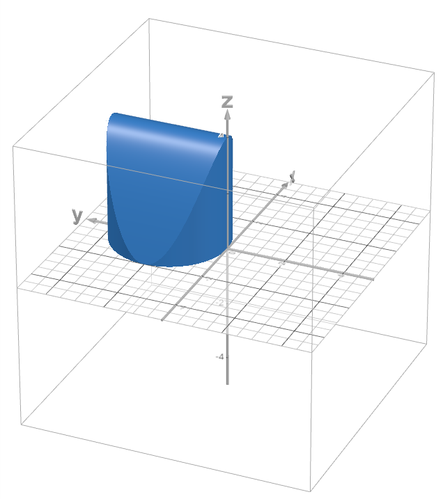

### Объём тела тройным интегралом
$V-\int \int \int_{T}  \, dx \, dy \, dz$

Решаем в цилиндрических координатах
$x=r\cos \phi$
$y=r\sin \phi$
$z=z$

$$|J|=\begin{bmatrix} \cos \phi & -r\sin \phi & 0 \\\ \sin \phi & r\cos \phi & 0 \\\ 0 & 0 & 1\end{bmatrix}=r\cos^2\phi+r\sin^2\phi=r$$

Задача:
$T: x^2+y^2=4y; \ z=4-x^2; \ z=0$

Получим формулу окружности основания:
$x^2+y^2-4y+4=4\to x^2+(y-2)^2=4$

Перейдём в цилиндрические координаты:
$r^2 \cos^2 \phi+r^2 \sin ^2\phi=4r \sin \phi\to r=4 \sin \phi$
$z=4-r^2 \cos^2 \phi$

Теперь берём интеграл:

$V=\int \int \int_{T} r \, dr \, d\phi \, dz$ 
Тело симметрично, разбиваем на два. $\phi=[0\to \pi]$
$V= 2 \int_{0}^{\Pi/2}  \, d\phi \int_{0}^{4-r^2\cos^2\phi}  \, dz\int_{0}^{4\sin \phi} r \, dr$ $=2 \int_{0}^{\Pi/2}  \, d\phi \int_{0}^{4-r^2\cos^2\phi}  \, dz \cdot{8}\sin^2 \phi$
r пропал из интеграла, но не из пределов:
$V =2\int_{0}^{\Pi/2}  \, d\phi \int_{0}^{4-16 \sin^2 \phi\cos^2\phi}  \, dz \cdot{8}\sin^2 \phi$
$V =2\int_{0}^{\Pi/2} (4-16 \sin^2 \phi\cos^2\phi)\cdot{8}\sin^2 \phi \, d\phi$
$V =64\int_{0}^{\Pi/2} (1-4 \sin^2 \phi\cos^2\phi)\sin^2 \phi \, d\phi$
$[2\sin \phi \cdot \cos \phi=\sin_{2}\phi]$
$V=64\int_{0}^{\Pi/2} \cos^2 \phi \cdot \sin^2\phi \, d\phi$
$[\sin \phi \cdot \cos{2} \phi=\dfrac{1}{2} (\sin 3\phi+\sin \phi)]$

$V=64\int_{0}^{\Pi/2} \dfrac{1}{4} (\sin 3\phi+\sin \phi)^2 \, d\phi=16\int_{0}^{\Pi/2}(\sin^2 3\phi+2\sin{3} \phi \sin \phi+\sin^2 \phi) \, d\phi=$ $=16(\int_{0}^{\Pi/2}\sin^2 3\phi \, d\phi+\int_{0}^{\Pi/2}\sin 3\phi \cos \phi \, d\phi+\int_{0}^{\Pi/2}\sin^2 \phi \, d\phi)$
Понижаем степень 
$=16\left( \int_{0}^{\Pi/2} (\dfrac{1-\cos 6 \phi}{2}) \, d\phi+\int_{0}^{\Pi/2}(-\cos{4}\phi-\cos 2\phi) \, d\phi+\int_{0}^{\Pi/2}(\dfrac{1-\cos 2 \phi}{2})\, d\phi \right)$
$=(8\phi-\dfrac{4\sin{6}\phi}{3}-4\sin 4\phi-8\sin{2}\phi+8\phi- 4\cos \phi)|_{0}^{\Pi/2}$
$=8 \Pi$

Сферические координаты
$x=r\cos \phi \sin \theta$
$y=r\sin \theta \sin \phi$
$z=r\cos \theta$

$|J|=\begin{bmatrix} \cos \phi \sin \theta& r\cos \phi \cos \theta & -r\sin \phi \sin \theta \\\ \sin \phi \sin \theta& r\sin \phi \cos \theta & r\cos \phi \sin \theta \\\ \cos \theta & -r\sin \phi & 0\end{bmatrix}=$

$=r^2\cos^2\phi \cos^2 \theta \sin \theta+r^2 \sin^2 \phi \sin^3 \theta +r^2 \sin^2\phi \cos^2\theta \sin \phi+r^2 \cos^2\phi \sin^3\phi$
$=r^2\sin \theta$

### Посчитать массу 
$4\leq x^2+y^2+z^2\leq 36; y\geq \sqrt{ 3 }x;x\geq 0;z\geq 0; \mu(x;y;z)= \dfrac{y^2}{x^2+y^2+z^2}$

![[Pasted image 20240229125537.png]]
![[Pasted image 20240229125623.png]]

Итого - это часть фигуры, ограниченной сферами радиуса 2 и 6, в плоскости $xy$ ограничена прямой $y\geq \sqrt{ 3 }x$ и осью $y$ 

Переходим в сферические координаты:
1)$4\leq x^2+y^2+z^2\leq 36$
$4\leq r^2 \cos^2 \phi \sin^2 \theta + r^2 \sin \phi \sin^2 \theta+r^2 \cos^2 \phi\leq 36$
$4\leq r^2\leq 36\to{2}\leq r\leq 6$

2)$r\sin \phi \sin \theta\geq \sqrt{ 3 }r\cos \phi \sin \theta$
$\sin \phi\geq \sqrt{ 3 }\cos \phi\to tg\phi\geq \sqrt{ 3 }$

3)$\mu(r,\phi,\theta)= \dfrac{r^2\sin^2 \phi \sin^2 \theta}{r^2 \cos^2 \phi \sin^2 \theta + r^2 \sin \phi \sin^2 \theta+r^2 \cos^2 \phi}=\dfrac{r^2\sin^2 \phi \sin^2 \theta}{r^2}=$
$=\sin^2 \phi \sin^2 \theta$

$M=\int \int \int_{T} \mu(x,y,z) \, dx \, dy \, dz=$$\int \int \int \sin^2\phi \sin^2\theta \cdot r^2 \sin \theta \, dr \, d\phi \, d\theta$

$\int_{{\Pi}/{3}}^{\Pi/2}  \, d\phi \int_{0}^{\Pi/2}  \, d\theta \int_{2}^6 \sin^2\phi \sin^2\theta \cdot r^2 \sin \theta \, dr=$
$\int_{{\Pi}/{3}}^{\Pi/2}  \, d\phi \int_{0}^{\Pi/2}  \, d\theta  \dfrac{\sin^2\phi \sin^3\theta  }{3} r^3|_{2}^6 = \dfrac{208}{3}(\int_{{\Pi}/{3}}^{\Pi/2}  \, d\phi \int_{0}^{\Pi/2} (  \sin^2\phi \sin^3\theta) \, d\theta$

$[\sin{3} \alpha = 3 \sin \alpha- 4 \sin^3\alpha]$
$[\sin^3 \alpha = \dfrac{-\sin^3\alpha+3\sin\alpha }{4}]$

$=\dfrac{52}{3}(\int_{{\Pi}/{3}}^{\Pi/2}  \, d\phi (\sin^2\phi)\int_{0}^{\Pi/2} (   3\sin\theta- \sin{3} \theta) \, d\theta=$
$=\dfrac{52}{3}(\int_{{\Pi}/{3}}^{\Pi/2}  \, d\phi (\sin^2\phi) (   -3\cos\theta+ \dfrac{\cos{3} \theta}{3})|_{0}^{\Pi/2}$
$\dfrac{52}{3}(\int_{{\Pi}/{3}}^{\Pi/2}  \, d\phi (\sin^2\phi)(3-\dfrac{1}{3})=\dfrac{416}{9}\int_{{\Pi}/{3}}^{\Pi/2} (\dfrac{1-\cos{2}\phi}{2})\, d\phi$

$= \dfrac{416}{9}(\dfrac{\phi}{2}-\dfrac{\sin{2}\phi}{4})|_{\Pi/3}^{\Pi/2}=\dfrac{416}{6}(\dfrac{\Pi}{12}+\dfrac{\sqrt{ 3 }}{8})$
